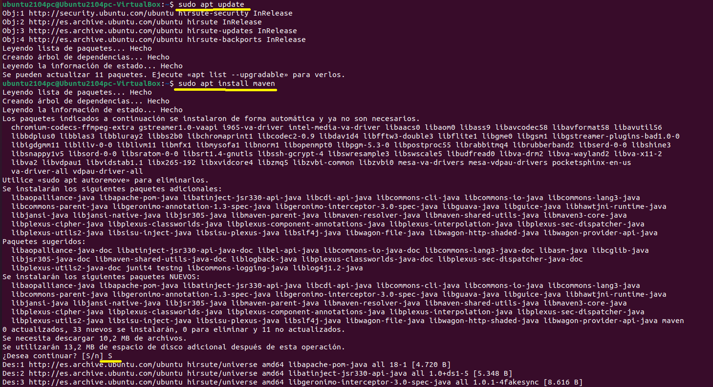
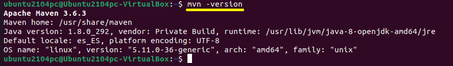
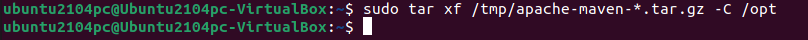
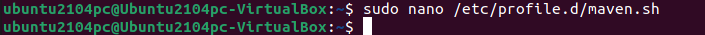
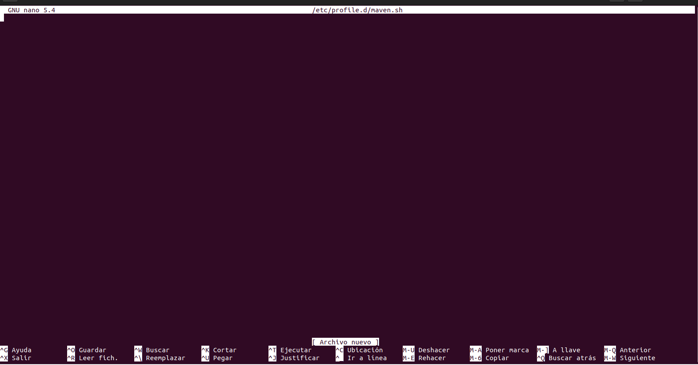
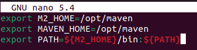
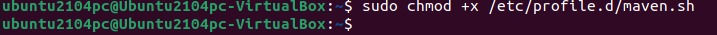
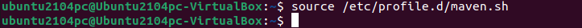
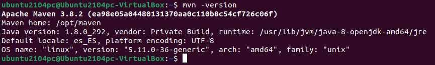

# Instalación de Maven en el SO

## 1.Instalar Apache Maven

 Actualizamos el sistema y Maven ingresando los siguientes comandos:

```
 sudo apt update
```
```
 sudo apt install maven
```



 Para verificar la instalación, ejecutamos mvn -version:
```
 mvn -version
```



 Eso es todo. Maven ahora está instalado en su sistema y puede comenzar a usarlo.

## 2.Instalar una versión concreta de Apache Maven


 Descargue Apache Maven en el directorio /tmp:

```
wget https://www.apache.org/dist/maven/maven-3/3.8.2/binaries/apache-maven-3.8.2-bin.tar.gz -P /tmp
```


 Una vez que se complete la descarga, extraemos el archivo en el directorio /opt
```
sudo tar xf /tmp/apache-maven-*.tar.gz -C /opt
```


 Para tener más control sobre las versiones y actualizaciones de Maven, ejecutamos lo siguiente al directorio de instalación de Maven:

```
sudo ln -s /opt/apache-maven-3.8.2 /opt/maven
```


## 3.Establecer variables de entorno
 A continuación, necesitaremos establecer las variables de entorno. Para hacer esto, abrimos su editor de texto y creamos un nuevo archivo llamado mavenenv.sh en el directorio /etc/profile.d/
```
sudo nano /etc/profile.d/maven.sh
```


Se nos abrirá el editor de texto Nano que tiene el siguiente aspecto:



En el que pegamos el siguiente código:

```
 export M2_HOME=/opt/maven
 export MAVEN_HOME=/opt/maven
 export PATH=${M2_HOME}/bin:${PATH}
```



 Guardamos el archivo presionando Ctrl+O y luego pulsando Enter, es decir, lo guardamos en el directorio que nos pone por defecto:
 
 
 
 Salimos del editor pulsando Ctrl+x 

 Hacemos que el script sea ejecutable con chmod:

```
 sudo chmod +x /etc/profile.d/maven.sh
```


 Finalmente, cargamos las variables de entorno usando el comando de source
```
 source /etc/profile.d/maven.sh
```



## 4.Verificar la instalación

Para verificar que Maven está instalado, usamos el mvn -version que imprimirá la versión de Maven:

```
mvn -version
```


